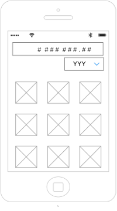

Hello, so I made a small error when setting up this project. I did my development over at https://github.com/Alvtag/currencyConverter/; I've migrated the code over to this repo, but that means the git history got squelched. The linked project above has the development git history.

~Alvin Fong

#Mobile App Developer Coding Challenge

## Goal:

#### Develop a currency conversion app that allows a user to convert an input value by any of the supplied rates.

- [ ] Fork this repo. Keep it public until we have been able to review it.
- [ ] Android: _Java/Kotlin_ | iOS: _Swift_
- [ ] exchange rates must be fetched from: http://fixer.io/  
- [ ] rates should be persisted locally and refreshed no more frequently than every 30 minutes
- [ ] user must be able to select the input currency from the list of supplied values

### Evaluation:
- [ ] App operates as asked
- [ ] No crashes or bugs
- [ ] SOLID principles
- [ ] Code is understandable and maintainable

UI Suggestion: Input field with a drop-down currency selector, and a list/grid of converted values below.

